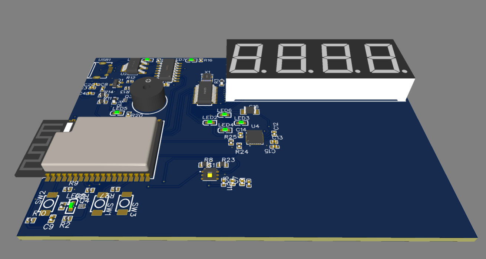
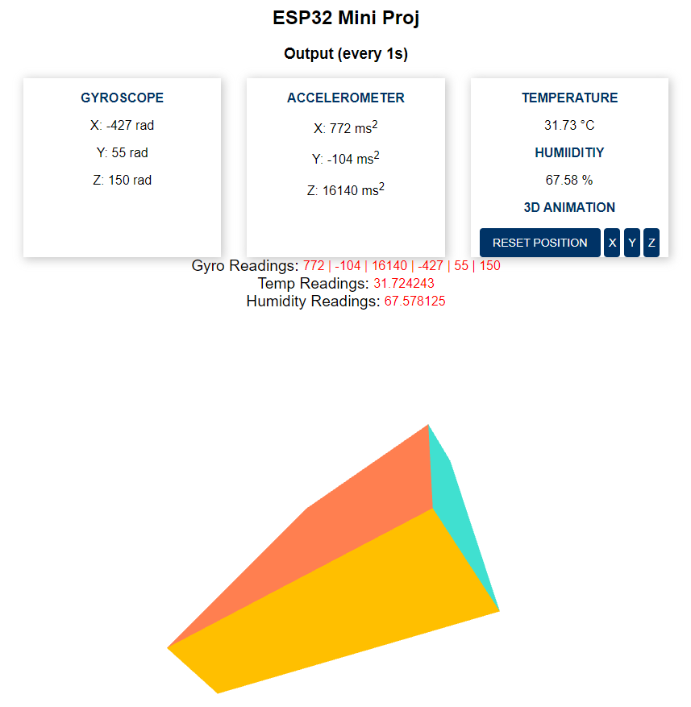

# ESP32 Thermal Gyro

Mini project that i designed on EASYEDA consisting of an ESP32 with thermal and gyro sensors on a 2 layer PCB.

Read the [things to take note](#things-to-take-note) below if you are interested to reproduce this project :)

## Features

- Gyroscope, Accelerometer (MPU-6050_C24112)
- Humidity, Temperature (HDC1080DMBR)
- USB to Serial (CH340C)
- Microcontroller (ESP32-WROVER-E)
- LED Driver (LED1642GWPTR)
- Buzzer (HNB09A05)
- 4 display 7 segment (FJ5461BH-red-orange)
- Serveral LEDs to display the functionality of the board chips and microC
- Webserver that displays Gyro/Acc, Temp/Humidity readings per 1 second.

## Takeaways

- Surface mount soldering
- Basic circuit designing
- Basic PCB routing & tracing
- GPIO interactions
- Managing serial communication protocols (I2C)
- Controlling LED Driver via toggling CLK SDI and LE Pins
- Using char arrays than String functions to reduce heap consumption
- Threejs to create objects
- Data collection from server and vice versa via different methods

## Work in progress

- Explore using a 3d model to show the movement of the board based on gyro readings

## How it looks like

## Things to take note

- Watch out when choosing a Mosfet to drive a component. Make sure that it saturates upon the correct GATE-SOURCE VOLTAGE (V)
- Read the data sheet ensure it is an IO port before connecting to I2C bus... (port 34,35 are NOT I2C bus compatible)
- CHANGE PORT 34,35 TO 23,22 FOR I2C comms
- Check the schematic and ensure all pins go to where they are suppose to go
- HDC1080 has different configuration from HDC2010 and 2080 hence their software kits wont work. Also, you must edit the SDA SCL pins yourself Via Wire.h
- NOT ENOUGH CURRENT TO DRIVE 7 SEGMENT (Do similar transistor circuit (buzzer) for anode 7 segments)
- To concurrently run 2 I2C channels, must make use of the Wire.h library and edit the sensor's own I2C connection portion
- Also, i believe it is possible to run 2 sensor via the same I2C channel as they have different addresses
- Wire your I2C components to the default pins to reduce the need to configure on the fly

## References

- *[Webserver guide](https://randomnerdtutorials.com/esp32-mpu-6050-web-server/)*
- *[Json guide](https://arduinojson.org/)*
